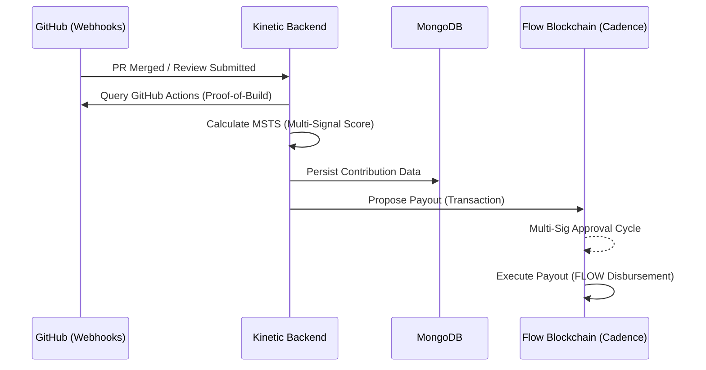
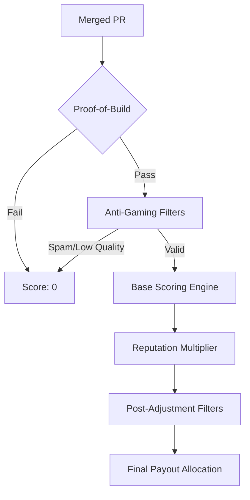

# Kinetic ⚡

[](https://github.com/namish18/Kinetic)
[](LICENSE)
[](https://github.com/namish18/Kinetic)

**Kinetic** is a meritocratic funding platform purpose-built for Protocol Labs contributors. It replaces vanity "green square" metrics with a **mathematically rigorous scoring engine** that measures the true engineering complexity and ecosystem impact of open-source work.

### 🚫 The Problem
Traditional bounty systems are "first-come, first-served" or based on simplistic commit counts. This leads to **micro-PR farming**, **code bloat**, and **reputation dominance**, where new, high-quality contributors struggle to compete against established "elites."

### ✨ The Kinetic Solution
Kinetic triangulates six independent signal layers using its **MSTS engine** to determine a contributor's final value. It incentivizes **high-leverage engineering**, **cross-repo collaboration**, and **production-grade reliability**.


---

## Table of Contents

- [Architecture Overview](#architecture-overview)
- [How to Run the Project](#how-to-run-the-project)
  - [Prerequisites](#prerequisites)
  - [Backend Setup](#backend-setup)
  - [Frontend Setup](#frontend-setup)
  - [Flow Blockchain Setup](#flow-blockchain-setup)
- [Features](#features)
  - [The Contribution Scoring Engine (MSTS v2)](#the-contribution-scoring-engine-msts-v2)
  - [Proof-of-Build Verification](#1-the-verification-gate-proof-of-build)
  - [Decentralized Identity](#decentralized-identity)
  - [Autonomous FLOW Payouts](#autonomous-flow-payouts)

- [Sponsor Integration](#sponsor-integration)
  - [Flow Blockchain](#flow-blockchain)
  - [Filecoin Foundation](#filecoin-foundation)
- [Project Structure](#project-structure)
- [API Reference](#api-reference)
- [License](#license)

---

## Architecture Overview

Kinetic is organized as a monorepo consisting of three principal layers, achieving a seamless transition from code contribution to on-chain payout.



| Layer | Technology | Purpose |
|-------|-----------|---------|
| **Frontend** | Next.js 16, React 19, Tailwind CSS 4, GSAP | High-fidelity dashboard for organizations and contributors. |
| **Backend** | Node.js, Express, MongoDB, Passport (OAuth) | Scoring engine, DID management, and webhook orchestration. |
| **Blockchain** | Flow Testnet, Cadence, FCL | Secure, transparent treasury management and multi-sig distributions. |


---

## How to Run the Project

### Prerequisites

Ensure the following tools are installed on your system before proceeding:

- **Node.js** v20 or later
- **npm** v9 or later
- **MongoDB** (local instance or a hosted service such as MongoDB Atlas)
- **Git**
- **Flow CLI** (required only for smart contract development and deployment)

You will also need the following external accounts and credentials:

- A **GitHub OAuth Application** (Client ID and Client Secret)
- A **MongoDB** connection string
- A **Flow Testnet** account (for blockchain interactions)

### Backend Setup

1. Clone the repository and navigate to the backend directory:

   ```bash
   git clone <repository-url>
   cd kinetic/backend
   ```

2. Install dependencies:

   ```bash
   npm install
   ```

3. Create a `.env` file in the `backend/` directory with the following variables:

   ```env
   PORT=5000
   MONGODB_URI=<your-mongodb-connection-string>
   GITHUB_CLIENT_ID=<your-github-oauth-client-id>
   GITHUB_CLIENT_SECRET=<your-github-oauth-client-secret>
   SESSION_SECRET=<a-secure-random-string>
   JWT_SECRET=<a-secure-random-string>
   FRONTEND_URL=http://localhost:3000
   FLOW_ADDRESS=<your-flow-testnet-account-address>
   FLOW_PRIVATE_KEY=<your-flow-testnet-private-key>
   ```

4. Start the development server:

   ```bash
   npm run dev
   ```

   The API will be available at `http://localhost:5000`. A health check endpoint is accessible at `http://localhost:5000/health`.

### Frontend Setup

1. Navigate to the frontend directory:

   ```bash
   cd kinetic/frontend
   ```

2. Install dependencies:

   ```bash
   npm install
   ```

3. Create a `.env` file in the `frontend/` directory with the following variables:

   ```env
   NEXT_PUBLIC_FLOW_ADDRESS=<your-flow-testnet-contract-address>
   NEXT_PUBLIC_FLOW_NETWORK=testnet
   ```

4. Start the development server:

   ```bash
   npm run dev
   ```

   The application will be available at `http://localhost:3000`.

### Flow Blockchain Setup

The smart contract layer uses Cadence, the native language for the Flow blockchain. To deploy or modify contracts:

1. Navigate to the Flow directory:

   ```bash
   cd kinetic/backend/flow
   ```

2. To deploy the `KineticPayout` contract to the Flow Testnet:

   ```bash
   flow project deploy --network=testnet
   ```

3. To run Cadence scripts (read-only operations):

   ```bash
   flow scripts execute cadence/scripts/get_balance.cdc --network=testnet
   ```

4. To submit transactions (state-changing operations):

   ```bash
   flow transactions send cadence/transactions/propose_payout.cdc --network=testnet
   ```

Refer to the [Flow CLI Documentation](https://developers.flow.com/tools/flow-cli) for additional commands and configuration options.

---

## Features

### The Contribution Scoring Engine

Kinetic moves beyond "vanity metrics" (like commit counts or lines of code) by employing a multi-staged algorithmic pipeline. This engine ensures that payouts are mathematically proportional to the **actual engineering value** delivered.

#### 1. The Verification Gate: Proof-of-Build
Before any analysis occurs, every contribution must pass the **Proof-of-Build** gate. Kinetic queries the GitHub Actions API to verify that the specific commit hash successfully passed all CI/CD integration tests.
> [!IMPORTANT]
> Merged code without a corresponding successful build trace receives a final score of **zero**.

#### 2. The Algorithmic Pipeline



#### 3. Core Scoring Components

| Layer | Component | Description |
| :--- | :--- | :--- |
| **Filter** | **Anti-Gaming** | Hard cutoffs for quality (<0.3) and impact (<0.2) to prevent "micro-PR" farming. |
| **Base** | **Impact & Complexity** | Log-scaled complexity calculation `log(lines + 1) / log(max + 1)` prevents reward for "code bloat". |
| **Base** | **Review Depth** | Maintainer review scores and comment density; rewards "consensus-building" code. |
| **Incentive**| **Reputation (1.5x)** | A capped 1.5x multiplier based on historical consistency and "Code Survival Rate". |
| **Stability**| **Diminishing Returns** | Applies a penalty factor `1 / (1 + 0.1*(k-1))` for high-frequency PR spamming. |

#### 4. The Math Behind the Meritocracy

The final score for any contribution $i$ is calculated as:
$$FinalScore_i = \left( \sum w_n \cdot Metric_{ni} \right) \times \left( 1 + \lambda \cdot \log(Reputation_i + 1) \right) \times Penalty_{spam}$$

This dual-layered approach balances objective PR metrics with long-term ecosystem health.


### Decentralized Identity

Contributors authenticate via GitHub OAuth. Upon first login, Kinetic mints a **Decentralized Identifier (DID)** using the `key-did-provider-ed25519` standard from the Ceramic / Protocol Labs stack. DID documents are stored on an in-process Helia IPFS node. This cryptographic identity binds a contributor's commits, pull requests, and issues as verifiable credentials.

### Autonomous FLOW Payouts

Payout distribution is handled entirely on-chain through the `KineticPayout` Cadence smart contract deployed on the Flow Testnet. The contract supports:

- **Treasury Management** -- Organizations deposit FLOW tokens into a managed treasury vault.
- **Payout Proposals** -- Authorized signers submit payout batches specifying recipient addresses and amounts.
- **Multi-Signature Approvals** -- Payouts require a configurable threshold of approvals from authorized signers before execution.
- **Direct Execution** -- Once the approval threshold is met, funds are disbursed directly to contributor wallets.

The frontend integrates with the Flow Client Library (FCL) for wallet authentication, balance queries, and transaction signing. Contributors can connect their Flow wallet, view pending payouts, and approve or execute distributions directly from the dashboard.

---

## Sponsor Integration

Kinetic has been built in direct collaboration with its hackathon sponsors, integrating their technologies as foundational infrastructure rather than superficial branding.

### Flow Blockchain

Flow serves as the settlement layer for all contributor payouts. The integration spans the full stack:

- **Smart Contracts**: The `KineticPayout.cdc` contract, written in Cadence, manages treasury deposits, payout proposals, multi-signature approvals, and token disbursement on the Flow Testnet.
- **Backend Services**: The `flowService.js` module handles server-side interactions with the Flow network, including transaction construction and submission.
- **Frontend Integration**: The FCL library is configured in `src/lib/flow.ts` to connect to the Flow Testnet access node and discovery wallet. All read operations (treasury balance, payout details, signer lists) and write operations (submit, approve, execute payouts, deposit funds) are implemented as typed wrapper functions.
- **Visual Presence**: The Flow logo is prominently featured in the `OrbitingEcosystem` component on the landing page, orbiting the central Kinetic icon alongside other ecosystem partners.

### Filecoin Foundation

Filecoin Foundation's presence is reflected in both the product design and the platform's target audience:

- **Target Ecosystem**: Kinetic is designed to measure and reward contributions to Protocol Labs repositories, which include the Filecoin network, IPFS, libp2p, and related infrastructure.
- **Visual Presence**: The Filecoin Foundation logo appears in the `OrbitingEcosystem` component on the landing page, representing the broader Protocol Labs ecosystem that Kinetic serves.
- **DID Infrastructure**: The Decentralized Identifier system, powered by the Ceramic / Protocol Labs stack, reflects the decentralized identity principles championed by the Filecoin ecosystem.

---

## Project Structure

```
kinetic/
  backend/
    config/             # Database connection and Passport OAuth configuration
    flow/
      cadence/
        contracts/      # KineticPayout.cdc smart contract
        scripts/        # Read-only Cadence scripts
        transactions/   # State-changing Cadence transactions
        tests/          # Cadence integration tests
      flow.json         # Flow project configuration
    models/             # Mongoose data models
    routes/             # Express route handlers (auth, contribution, kinetic, repo, webhook)
    services/           # Core business logic (contribution scoring, DID, Flow, kinetic mechanisms)
    server.js           # Application entry point
  frontend/
    src/
      app/              # Next.js App Router pages (dashboard, bounties, docs, voting, onboarding)
      components/       # Reusable UI components (PillNav, LogoLoop, OrbitingEcosystem, etc.)
      lib/              # Shared utilities and Flow blockchain client (flow.ts)
  contribution_algo.md  # Detailed specification of the contribution scoring algorithm
  readme.md             # This file
```

---

## API Reference

The backend exposes the following primary endpoints:

| Method | Endpoint | Description |
|--------|----------|-------------|
| `GET` | `/api/auth/github` | Initiate GitHub OAuth authentication flow |
| `GET` | `/api/auth/github/callback` | OAuth callback; creates DID on first login |
| `GET` | `/api/auth/me` | Retrieve current user profile (JWT required) |
| `GET` | `/api/auth/did/:username` | Resolve a DID by GitHub username (public) |
| `GET` | `/api/auth/did-resolve/self` | Re-resolve the authenticated user's DID (JWT required) |
| `PUT` | `/api/auth/wallet` | Link a Flow wallet address to the authenticated account (JWT required) |
| `GET` | `/api/auth/logout` | Terminate the current session |
| `GET` | `/health` | Health check endpoint |

Additional routes are available under `/api/contribution`, `/api/kinetic`, `/api/org`, and `/api/webhook` for contribution scoring, kinetic mechanism queries, organization repository management, and GitHub webhook processing, respectively.

---

## License

This project is licensed under the ISC License. See the repository for details.
